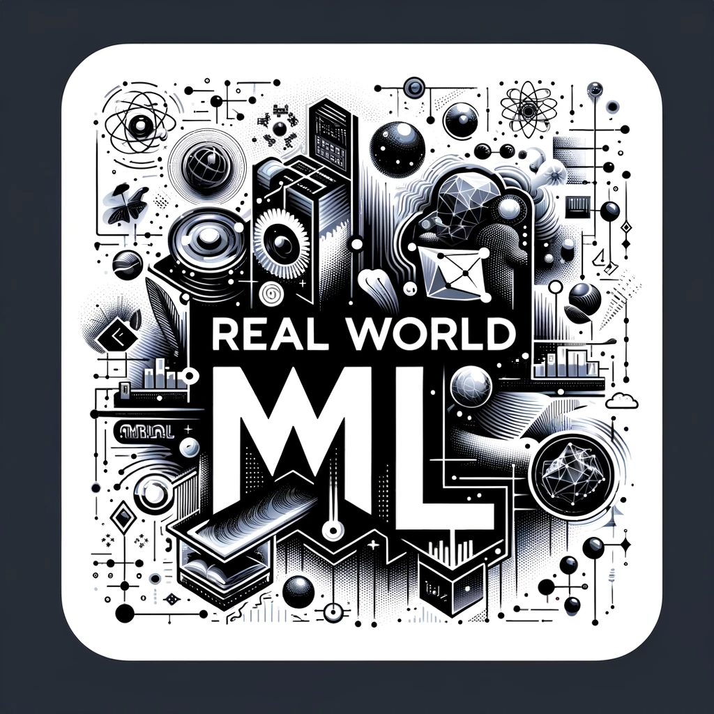

# Learn and Apply ML/DL to Real World

  

Hey there! 👋 If you're looking to understand ML/DL beyond just theory and want to apply it to real-world problems, you're in the right place.

## What's Inside?

### 1. Building From The Ground Up 🔨
Ever wondered what's really happening under the hood of ML algorithms? We break down complex concepts into digestible pieces and rebuild them from scratch. Here's what makes our approach special:

- **Back to Basics**: Clear, step-by-step explanations that help you truly understand what's going on
- **Popular Algorithms Demystified**: From Bayesian Hyperparameter Optimization to Neural Networks and Gradient Boosting - we've got you covered
- **Learn by Doing**: Dive into well-documented code that you can actually understand and experiment with

### 2. Real-World Magic 
Theory is great, but the real fun begins when you start solving actual problems. We've packed this repo with practical projects across different domains:

- **Recommendation Systems**: Build systems that understand user preferences and make smart suggestions
- **Computer Vision**: Get your hands dirty with Object Detection, Segmentation, and more
- **Natural Language Processing**: Teach machines to understand and work with human language
- **Time Series Forecasting**: Predict future trends in everything from stock prices to weather patterns

## Getting Started 🚀

1. Clone this repo and explore what interests you
2. Each project has its own README with everything you need to know
3. Fire up the code and start experimenting!

## Let's Connect 💬

Questions? Ideas? Just want to chat about ML? Drop an issue.
